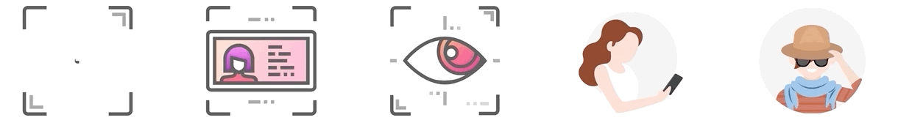

# Element Face UI
The Element Face UI is a library for customization of face capture screens. It requires [Element Face SDK](element-face-sdk-guide.md) to work.

## Installation
1. Import the AAR (`element-face-ui-[VERSION].aar`) in Android studio
1. Declare `element-face-ui` in `settings.gradle` in the project root
    ```
    include ':element-face-ui'
    ```
1. Add `element-face-ui` as a dependency `build.gradle` in the app module
    ```
    dependencies {
        implementation project(path: ':element-face-ui')
    }
    ```

## Face UI Style Guide
Element Face Detection UI components can be themed/styled based on business requirements. This document discusses some of the classes involved in configuring them.

### Notable Overrides
#### Timings

Create new value resource in `res/values` and add

```
    <integer name="key">value</integer>
```

Keys:

| Key | Default Value (ms) | Notes |
|---|---|---|
| elementFaceUiGazeFlowerAnimDurMs | 1000 | Animation speed for first, _spinning flower_, part of gaze animation. |
| elementFaceUiGazeLoaderAnimDurMs | 2000 | Animation speed for second, _checkmark loader_, part of gaze animation. |
| elementFaceUiOutlineAnimDurMs | 1800 | Animation speed for Face Detection progress outline. |

#### Colors

Create new value resource in `res/values` and add  

```
    <color name="key">#color</color>
```

Keys:

| Key | Default Value | Notes |
|---|---|---|
| elementFaceUiCheckmarkButton | #FF00A8FF | Checkmark button, not the checkmark itself which is always white. |
| elementFaceUiFlowerPetal | #80FFFFFF | Spinning circles in first half of `CheckmarkLoaderView` animation. |
| elementFaceUiRingColor | #FFFFFFFF | Starting color of "ring" in `CheckmarkLoaderView`, end color is `elementFaceUiCheckmarkButton`. |
| elementFaceUiOutlineNormalColor | #FFB2B2B2 | Default color of Face Detection outline. |
| elementFaceUiOutlineDetectedColor | #FF00A8FF | Active color of Face Detection outline. |
| elementFaceUiOutlineErrorColor | #FFE00C0C | Error color of Face Detection outline. |
| elementFaceUiStencilBgColor | #AA000000 | Color used as background of Face Detection screen. |

#### Drawables

Create new value resource in `res/values` and add  

```
    <drawable name="key">@drawable/filename</drawable>
```

Keys:

| Key | Default Value | Notes |
|---|---|---|
| elementFaceUiOutlineCompletionMarker | @drawable/ic_check | The icon that appears when Face Detection is complete. |

#### Strings
Go to `src/main/res/values/strings.xml` and add
```
    <string name="string_key" tools:override="true">YOUR TEXT</string>
```
String Keys:

| Key | Default Text |
|---|---|
| center_face | Center face in frame |
| keep_centered | Keep face centered  |
| watch_circles | Watch the circles  |
| clear_face_view | Make sure we have a clear view of your face |
| hold_phone_eye_level | Hold phone at eye level |
| | |
| selfie_move_message | We\'ll automatically take a selfie then you\'ll be prompted to move your eyes to make sure it\'s you. |
| selfie_message | You\'ll be asked to frame your face then we\'ll snap a selfie. |


#### Animations
We're using LottieFiles json animations. Just put the exact file name in the right directory below to override it.

https://lottiefiles.com/featured



From left to right:

| File Name | File Location |
|---|---|
| ic_selfie.json | src/main/res/raw/ic_selfie.json |
| ic_scan.json | src/main/res/raw/ic_scan.json |
| ic_move.json | src/main/res/raw/ic_move.json |
| ic_eye_level.json | src/main/res/raw/ic_eye_level.json |
| ic_clear_face.json | src/main/res/raw/ic_clear_face.json |
