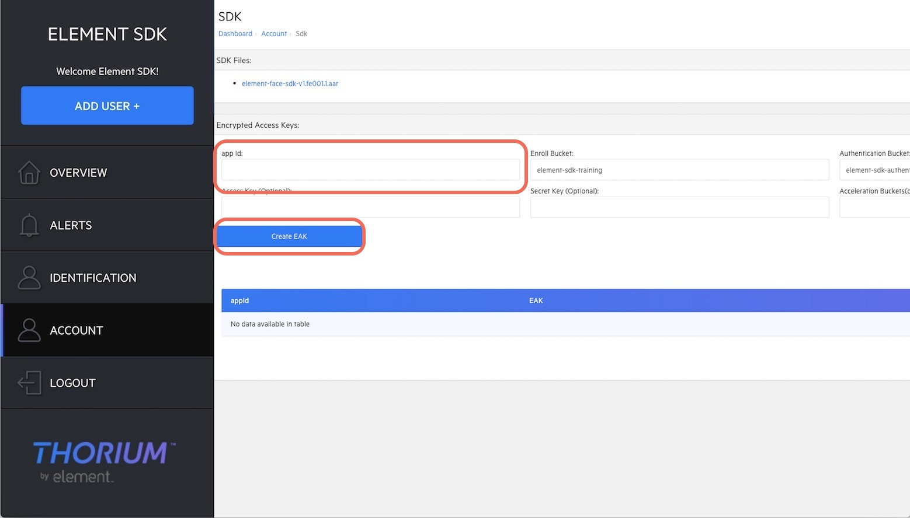

## Prerequisites of Element Face SDK and Element Card SDK

### Element Dashboard
The Element Dashboard is the gateway providing the assets in order to use the Element Face SDK and Element Card SDK. The URL of the Element Dashboard varies based on your region. An account is required to access the Element Dashboard. Please contact [Element](#questions) for more information.

### Register the Application Id (App Id) and obtain the Encrypted Access Key (EAK)
The SDK requires the *Encrypted Access Key* (*EAK*) file. The *EAK* file contains encrypted metadata including the [Application Id (App Id)](https://developer.android.com/studio/build/application-id) of your Android app. Your registered *EAK* is available on the Element Dashboard, under `Account -> SDK`.
To obtain a new *EAK* file:
1. On the same page of where you download the SDK file, fill in the `App Id` field with your `application id`. You can find your `application id` in your module-level `build.gradle` file. Leave other fields unchanged and click `Create EAK`.
1. You new EAK will be listed on the page. Hover your mouse on the EAK you want to download and a little download icon will appear next to your `app id`. Click it, name the file `element.eak` and save it to the desktop of your computer.


## Setup with Android Studio
### Element Maven Repository
The Element Face SDK and Element Card SDK are distributed via the Element Maven server. Keys are needed for access.
1. After receiving the keys, add them to `local.properties` as
    ```
    elementMavenAccessKey=[PLACEHOLDER]
    elementMavenSecretKey=[PLACEHOLDER]
    ```
1. Set `globalElementSdkVersion` to the version of the SDK to be distributed in `build.gradle` at the project level.
    ```
    buildscript {
        ext {
            ...
            globalElementSdkVersion = '[PLACEHOLDER]'
            ...
        }
    ```
1. Load from `loacl.properties` and declare the maven repository in `build.gradle` at the project level.
    ```
    Properties properties = new Properties()
    properties.load(project.rootProject.file('local.properties').newDataInputStream())

    ...

    allprojects {
        repositories {
            maven {
                url "s3://maven.android.discoverelement.com/releases"
                credentials(AwsCredentials) {
                    accessKey elementMavenAccessKey
                    secretKey elementMavenSecretKey
                }
            }
        }
    }
    ```
    More details can be found in the [sample project](../build.gradle)

### Add the AAR as a dependency
According to usage, add the SDK as the dependency to `build.gradle` in your app modules.
```
dependencies {
    implementation "com.element:face-cam:${globalElementSdkVersion}"
}
```

### Declare Java 8 support
In the app-level `build.gradle`, add the block below to enable Java 8.

```
compileOptions {
    sourceCompatibility JavaVersion.VERSION_1_8
    targetCompatibility JavaVersion.VERSION_1_8
}
```

### Include the EAK in the application
1. Create a resources directory at `[project dir]/app/src/main/resources`.
1. Copy the `element.eak` file into the `resources` directory.


### Questions?
If you have questions, please contact devsupport@discoverelement.com.
