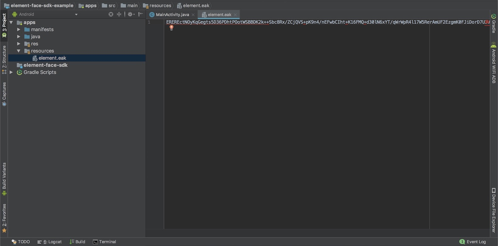

## Prerequisites of the Element Face SDK
### Element Dashboard
The Element Dashboard is the gateway providing the assets in order to use the Element Face SDK. The URL of the Element Dashboard varies based on your region. An account is required to access the Element Dashboard. Please contact [Element](#questions) for more information.

### AAR
The Element Face SDK is in the [AAR](https://developer.android.com/studio/projects/android-library) format. Follow the steps to access the AAR files on the Element Dashboard:
1. Log into the Element Dashboard with your account credentials.
1. Select `Account` tab in the left navigation bar.
1. Find the menu item named `SDK`, click the `View` button next to it.

1. Under `SDK Files` section, click the SDK download link(s) and save it. The actual links and AAR versions might be different depending on your account type.


### Register the Application Id (App Id) and obtain the Encrypted Access Key (EAK)
The Element Face SDK requires the *Encrypted Access Key* (*EAK*) file. The *EAK* file contains encrypted metadata including the [Application Id (App Id)](https://developer.android.com/studio/build/application-id) of your Android app. Your registered *EAK* is available on the Element Dashboard, under `Account -> SDK`.
To obtain a new *EAK* file:
1. On the same page of where you download the SDK file, fill in the `App Id` field with your `application id`. You can find your `application id` in your module-level `build.gradle` file. Leave other fields unchanged and click `Create EAK`.
1. You new EAK will be listed on the page. Hover your mouse on the EAK you want to download and a little download icon will appear next to your `app id`. Click it, name the file `element.eak` and save it to the desktop of your computer.


## Setup with Android Studio
### Import the AAR
1. Open your project in Android Studio.
1. On the top menu bar, click `File -> New -> New Module`. In the `Create New Module` window, click `Import .JAR/.AAR Package`, then click `Next`.
1. In the next window, click the the browse icon or `...` next to `File name` field and select the downloaded AAR file from the directory. Then type in the name of the AAR in the `Subproject Name` field.
1. Click the `Finish` button and wait for Android Studio to finish building the project.

### Add the AAR as a dependency
1. Add the AAR module to your project by adding the following code to the `settings.gradle` file in the root directory of your project:
    ```
    include ':[AAR name]'
    ```
1. On the top menu bar, click `File -> Project Structure`.
1. Select your app module under `Modules` on the left pane, click on the `Dependencies` tab, and click on the `+` button at the bottom of the window. In the popup, click `Module Dependency` and select `:[AAR name]`. Click `Ok`.

### Include the EAK in the application
1. Create a resources directory at `[project dir]/app/src/main/resources`.
1. Copy the `element.eak` file into the `resources` directory.


### Questions?
If you have questions, please contact devsupport@discoverelement.com.
